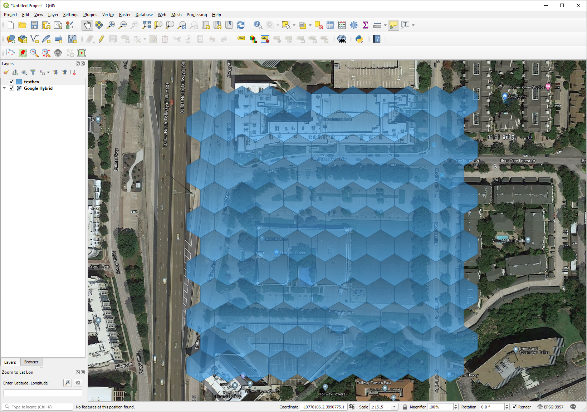
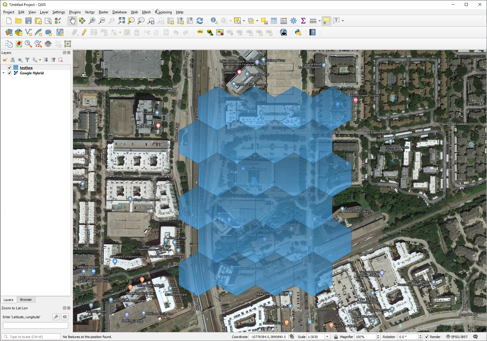

# geojson-hexagon-grid-builder
A simple class that generates a hexagon grid in longitude and latitude given a couple of basic parameters.  It applys the Haversine formula to adjust size of grid to the latitude it is required.  Note, it was intended to build a grid covering a finite geographic area, such as at the landownership level or within the proximity of the latitude selected. The GeoJson file that can be written out contains basic properties for each hexagon generated (e.g. the center point, call date, and a counter id).

## Parameters Required
<ul>
  <li>list of coordinates for bounding box in longitude and latitude (i.e. lower left and upper right)  Example: [-96.8211773, 32.9655743, -96.8190795, 32.9672722]</li>
  <li>numeric for kilometers for radius of hexagon, such as 0.015 for 15 meters</li>
  <li>string parameter "kilometer" - currently doesn't have any other unit conversions, such as feet, miles, etc.</li>
</ul>

# Installation
Simily add the attached python file to your work.

# Requirements
<ul>
  <li>import math</li>
  <li>import time</li>
  <li>import json</li>
</ul>

# Example Usage:
Call the class: 
hexgrid = Hexbuild([-96.8211773, 32.9655743, -96.8190795, 32.9672722], 0.015, "kilometers")

Write the results out to a file for use: 
geofile = open(r"c:\temp\testhex.json", "w") 
geofile.write(hexgrid.sendGeoJsonText()) 
geofile.close() 

Open the file in your favorite viewer, like ArcGIS Pro, QGIS, etc.: 
Here at 0.015 kilometers 
 
Here at 0.05 kilometers 
 
Enjoy if it is helpful to you! 
